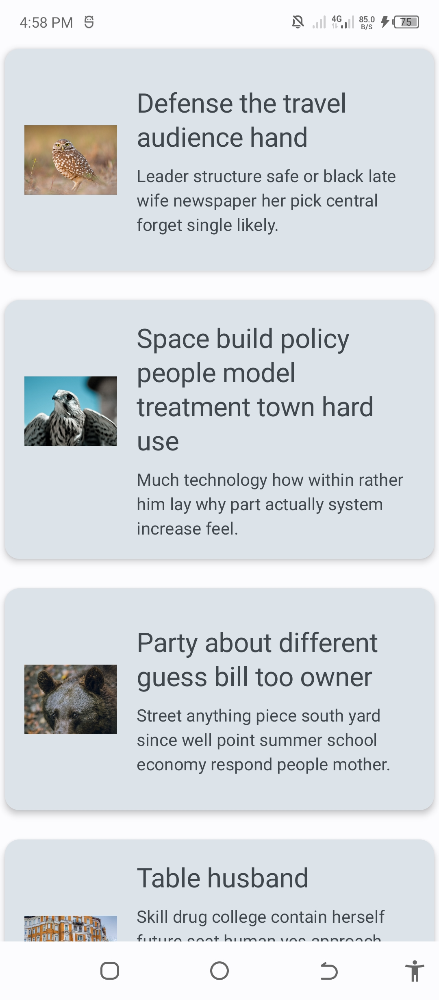

# Description
This is a fake REST API from https://www.slingacademy.com/article/sample-photos-free-fake-rest-api-for-practice/ to gather photos. It has a pagination from remote source to local database following the guide of Paging 3 from Android official documentation

# Images
